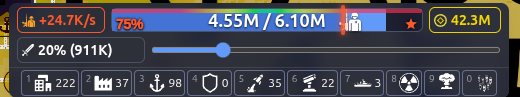
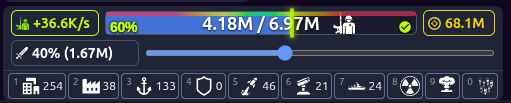

<h1 align="center">OpenFrontIO-TroopTiming</h1>

<p align="center">
  
</p>

<p align="center">
  <a href="README.md">English</a> · <a href="README.tr.md">Türkçe</a>
</p>

A userscript that adds a real-time troop timing overlay to [OpenFront.io](https://openfront.io/). Requires a userscript extension such as [Tampermonkey](https://www.tampermonkey.net/), [Greasemonkey](https://addons.mozilla.org/en-US/firefox/addon/greasemonkey/), or [Violentmonkey](https://violentmonkey.github.io/). ✨

## 🚀 Features

- 🎯 **Troop Timing Overlay** — Real-time troop bar overlay with color-coded strategy indicator
- 📊 Gradient bar showing troop percentage (0%–100%)
- ✨ Animated marker with smooth transitions
- 🎨 Color-coded strategy icons (star/checkmark/clock) based on troop ratio
- 🏷️ Troop badge override with matching colors
- 🔄 Falls back to DOM scraping if the game API is unavailable

## 📸 Screenshots

<p align="center">

&nbsp;&nbsp;

</p>

## 🛠️ Installation

1. Install a userscript extension in your browser:
   - [Tampermonkey](https://www.tampermonkey.net/) (Chrome, Firefox, Edge)
   - [Greasemonkey](https://addons.mozilla.org/en-US/firefox/addon/greasemonkey/) (Firefox)
   - [Violentmonkey](https://violentmonkey.github.io/) (Chrome, Firefox, Edge)
2. Install the script:

**[📥 Install Script](OpenFrontIO-TroopTiming.user.js)** · **[📥 Install from GreasyFork](https://greasyfork.org/scripts/580709-openfrontio-trooptiming)**

Or copy the contents of [`OpenFrontIO-TroopTiming.user.js`](OpenFrontIO-TroopTiming.user.js) into a new userscript.

3. Navigate to [openfront.io](https://openfront.io/) or [openfront.dev](https://openfront.dev/) — the overlay will appear automatically on game pages 🎮

## 📁 Repository Structure

```
OpenFrontIO-TroopTiming/
├── README.md # This file (English) 🇬🇧
├── README.tr.md # Turkish version 🇹🇷
├── AGENTS.md # AI agent knowledge base 🤖
├── .gitignore
├── OpenFrontIO-TroopTiming.user.js # Userscript (Tampermonkey/Greasemonkey)
├── assets/ # Project logos and screenshots 🖼️
│   ├── TroopTimingBackground.svg
│   ├── TroopTimingNoBackground.svg
│   ├── TroopTiming1.png
│   └── TroopTiming2.png
└── colors/ # Material Design 3 color schemes 🎨
```

## 💻 Development

The script is a single self-contained JavaScript file. No build step required. ⚡

To modify:
1. Edit `OpenFrontIO-TroopTiming.user.js`
2. In Tampermonkey, click the script icon → Edit
3. Or reinstall from the file

## 📜 License

Source code is licensed under AGPL v3. See [OpenFrontIO/LICENSE](https://github.com/openfrontio/OpenFrontIO/blob/main/LICENSE) for details. ⚖️
