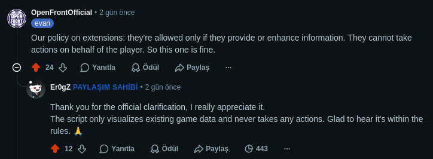

<h1 align="center">OpenFrontIO-TroopTiming</h1>

<p align="center">

</p>

<p align="center">
<a href="README.md">English</a> · <a href="README.tr.md">Türkçe</a>
</p>

<blockquote>
⚠️ <strong>Uyarı:</strong> Bu script, OpenFront.io'nun Kullanım Şartları'nı ihlal edebilir veya etmeyebilir. Eğitim amaçlıdır ve herhangi bir eylemi otomatikleştirmez — sadece mevcut oyun verilerini görselleştirir. Yazar, bu scriptin kullanımından doğabilecek her türlü sorun, hasar veya sonuçtan (hesap yasaklamaları dahil) sorumlu değildir. Kullanıcı kendi sorumluluğundadır.
</blockquote>

## ✅ Geliştiricinin Onayladığı Bilgiler

OpenFront.io'nun geliştiricisi **Evan** (u/OpenFrontOfficial), bu scripti inceleyerek kurallarımız çerçevesinde onayladığını belirtti:

> **"Our policy on extensions: they're allowed only if they provide or enhance information. They cannot take actions on behalf of the player. So this one is fine."**
> *(Çeviri: Eklentilerin politikamız şöyle: sadece bilgi sağlıyor veya zenginleştiriyorsa izin verilir. Oyuncunun adına işlem yapamazlar. Yani bu kural dışında değil.)*

- [Kaynak: Reddit yorum dizisi](https://www.reddit.com/r/Openfront/comments/1ttva2t/comment/op6ka4w/?screen_view_count=2)
- Bu script tamamen kuralara uyuyor: **sadece mevcut oyun verilerini görselleştirir** ve oyuncunun adına hiçbir eylemde bulunmaz.

## 📸 Geliştirici Yanıtı Ekran Görüntüsü

<p align="center">

</p>

<a href="https://openfront.io/" target="_blank" rel="noopener noreferrer">OpenFront.io</a> oyunu için gerçek zamanlı birlik (troop) timing overlay'i. Tek bir userscript. Çalışması için tarayıcınıza <a href="https://www.tampermonkey.net/" target="_blank" rel="noopener noreferrer">Tampermonkey</a>, <a href="https://addons.mozilla.org/en-US/firefox/addon/greasemonkey/" target="_blank" rel="noopener noreferrer">Greasemonkey</a> veya <a href="https://violentmonkey.github.io/" target="_blank" rel="noopener noreferrer">Violentmonkey</a> gibi bir kullanıcı betiği eklentisi yüklemeniz gerekir. ✨

## 🚀 Özellikler

- 🎯 **Troop Timing Overlay** — Gerçek zamanlı birlik çubuğu overlay'i
- 📊 Renk kodlu gradient çubuğu (0%–100%)
- ✨ Yumuşak geçişli animasyonlu marker
- 🎨 Birlik oranına göre renk kodlu strateji ikonları (yıldız/onay/saat)
- 🏷️ Birlik rozeti rengi override
- 🔄 Game API kullanılamıyorsa DOM scraping ile çalışır

## 📸 Ekran Görüntüleri

<p align="center">

&nbsp;&nbsp;

</p>

## 🛠️ Kurulum

1. Tarayıcınıza bir kullanıcı betiği eklentisi yükleyin:
- <a href="https://www.tampermonkey.net/" target="_blank" rel="noopener noreferrer">Tampermonkey</a> (Chrome, Firefox, Edge)
- <a href="https://addons.mozilla.org/en-US/firefox/addon/greasemonkey/" target="_blank" rel="noopener noreferrer">Greasemonkey</a> (Firefox)
- <a href="https://violentmonkey.github.io/" target="_blank" rel="noopener noreferrer">Violentmonkey</a> (Chrome, Firefox, Edge)
2. Scripti yükleyin:

**[📥 Scripti Yükle](OpenFrontIO-TroopTiming.user.js)** · **[📥 GreasyFork ile Yükle](https://greasyfork.org/scripts/580709-openfrontio-trooptiming)** · **[📥 OpenUserJS ile Yükle](https://openuserjs.org/scripts/Erogz/OpenFrontIO-TroopTiming)**

Veya [`OpenFrontIO-TroopTiming.user.js`](OpenFrontIO-TroopTiming.user.js) dosyasının içeriğini yeni bir kullanıcı betiğine kopyalayın.

3. <a href="https://openfront.io/" target="_blank" rel="noopener noreferrer">openfront.io</a> veya <a href="https://nightly.openfront.dev/" target="_blank" rel="noopener noreferrer">nightly.openfront.dev</a> adresine gidin — overlay otomatik olarak oyun sayfalarında görünecektir 🎮

## 📁 Deposun Yapısı

```
OpenFrontIO-TroopTiming/
├── README.md # İngilizce versiyon 🇬🇧
├── README.tr.md # Bu dosya (Türkçe) 🇹🇷
├── AGENTS.md # AI ajan bilgi bankası 🤖
├── .gitignore
├── OpenFrontIO-TroopTiming.user.js # Userscript (Tampermonkey/Greasemonkey)
├── assets/ # Proje logoları ve ekran görüntüleri 🖼️
│   ├── TroopTimingBackground.svg
│   ├── TroopTimingNoBackground.svg
│   ├── TroopTiming1.png
│   ├── TroopTiming2.png
│   └── DeveloperAnswered.png
└── colors/ # Material Design 3 renk şemaları 🎨
```

## 💻 Geliştirme

Script tek bağımsız bir JavaScript dosyasıdır. Build adımına gerek yoktur. ⚡

Değişiklik yapmak için:
1. `OpenFrontIO-TroopTiming.user.js` dosyasını düzenleyin
2. Tampermonkey'de script simgesine tıklayın → Düzenle
3. Veya dosyadan yeniden yükleyin

## 📜 Lisans

Kaynak kodu MIT lisansı altındadır. ⚖️
